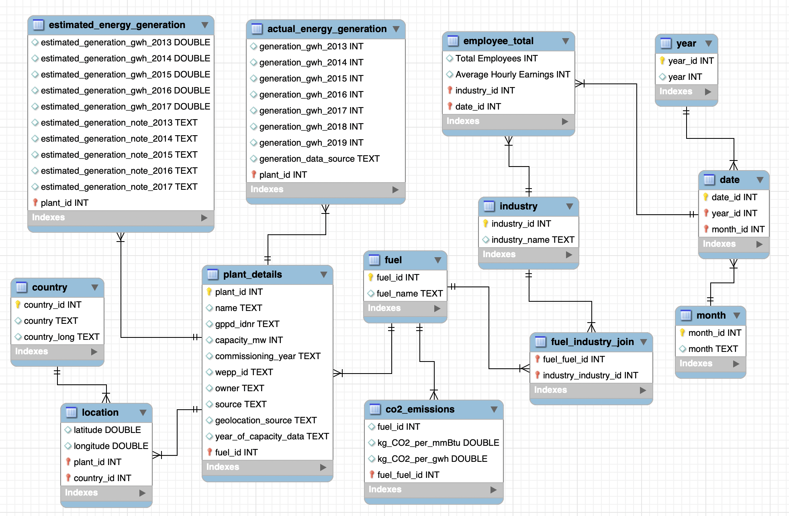

# Global Power Plant Database: An End-to-End Data Engineering Project




---

## 1. Project Overview

This project showcases an end-to-end data engineering solution for analyzing the global energy landscape. Faced with disparate and often incomplete datasets on power plants, CO₂ emissions, and energy sector employment, this project's goal was to build a reliable, centralized database to derive actionable insights.

The pipeline ingests raw data from multiple sources, cleans and transforms it into a structured format, loads it into a custom-designed relational database, and runs analytical queries to support strategic decision-making in the energy sector.

---

## 2. Key Achievements

*   **Data Ingestion & Cleaning:** Developed a robust data preparation pipeline using Python and Pandas within a Jupyter Notebook environment to handle missing values, standardize formats, and merge heterogeneous data sources.
*   **Database Design & Implementation:** Designed a normalized (3NF) relational database schema from scratch to ensure data integrity and query efficiency. The complete schema was implemented in MySQL.
*   **ETL Process:** Engineered the process for extracting data from raw files, transforming it in the Python environment, and loading the cleaned CSVs into the MySQL database using SQL scripts.
*   **Data Analysis & Insights:** Authored complex SQL queries to uncover key trends related to renewable energy growth, emissions compliance, and the economic impact of different fuel types on employment.
*   **Visualization:** Provided the analytical foundation for data visualizations in Tableau and other reporting tools, translating raw data into clear, business-focused insights.

---

## 3. Technology Stack

*   **Data Processing:** Python, Pandas
*   **Notebook Environment:** Jupyter
*   **Database:** MySQL
*   **Data Visualization & Reporting:** Tableau, PowerPoint

---

## 4. Data Pipeline Architecture

The project is structured to reflect a logical, sequential data engineering workflow, promoting clarity and reproducibility.

```
.
├── data/
│   ├── 1_raw/        # Original, unmodified source data
│   └── 2_processed/  # Cleaned, normalized CSV files ready for database import
├── database/
│   ├── model/        # Visual database schema (EER Diagram)
│   └── sql/          # SQL scripts for DDL, DML, and analytical queries
├── notebooks/
│   └── 1_data_preparation.ipynb  # Core script for data cleaning and transformation (ETL)
└── reports/
    └── ...           # Final presentations, Tableau workbooks, and exported visuals
```

---

## 5. Setup & Execution

To reproduce this data pipeline, please ensure you have a Python environment (with Pandas) and a running MySQL server.

**Step 1: Data Preparation**
*   Run the Jupyter Notebook at `notebooks/1_data_preparation.ipynb`. This script ingests the raw files from `data/1_raw/` and outputs clean CSVs to `data/2_processed/csv_files/`.

**Step 2: Database Creation**
*   Execute the DDL script `database/sql/1_schema.sql` on your MySQL server. This will create the required tables and relationships.

**Step 3: Data Loading**
*   Execute the DML script `database/sql/2_load_data.sql`. You may need to adjust the file paths inside the script to match the absolute path of the CSV files on your local machine.

**Step 4: Analysis**
*   Run the analytical queries found in `database/sql/3_analysis_queries.sql` to generate the project's key findings.

---

## 6. Analytical Insights

### Renewable Energy Hotspots
*   **Hydro:** China, Venezuela, and Brazil are the top 3 countries by capacity.
*   **Solar:** China, India, and the United States lead in solar capacity.
*   **Wind:** China, the United Kingdom, and the United States are leaders in wind energy.

### Emissions Compliance
*   **Key Insight:** In the USA, Petcoke and Coal are the largest contributors to CO₂ emissions.
*   **Trend:** A significant gap exists between the high emissions from non-renewables and the near-zero emissions from renewables, with an overall decrease in emissions during the studied period.

### Economic & Social Impact
*   **Employment Dominance:** The Gas sector employs 2-3 times more workers than other fuel types.
*   **Sector Decline:** Employment in oil, coal, and petcoke has declined by over 18% in 6 years.
*   **Gender Disparity:** A significant gender gap persists, with female employment below 21% in the coal, oil, and petcoke sectors.
